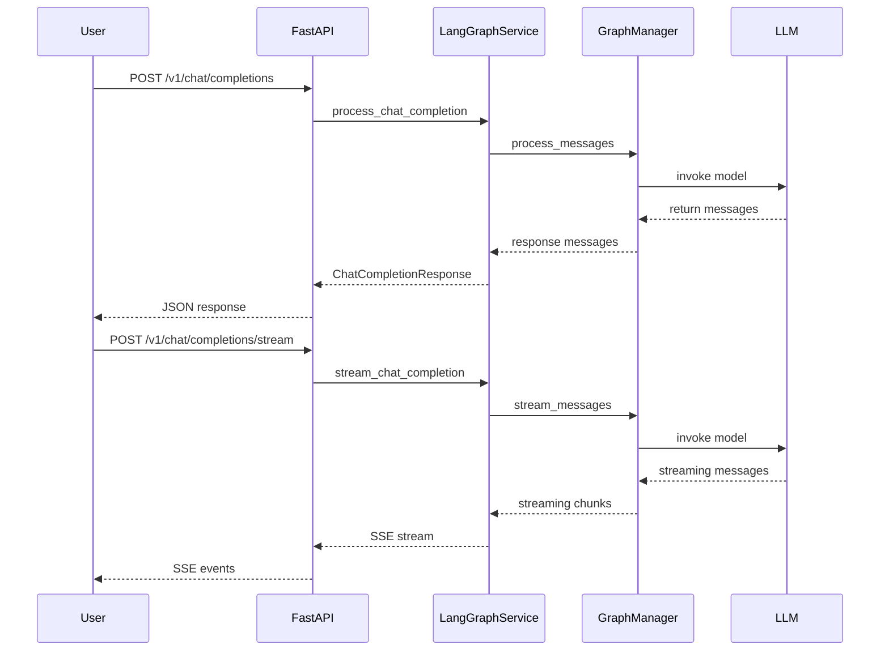

# Meu ChatGPT

## MVP (escopo mínimo viável)
- Endpoint `/v1/chat/completions` para chat simples
- Endpoint `/v1/chat/completions/stream` para streaming de respostas
- Health check em `/status`
- Frontend básico com janela de chat e envio de mensagens renderizando markdown como saída
Minha ideia é criar o meu chatgpt, com as minhas instruções, meus fluxos e minhas ferramentas.

### Como planejo implementar

- Backend Endpoiter com Python e FastAPI.
- Frontend construido com React (TypeScript) e Tailwind CSS.
- Usar LangGraph para fazer a montagem das LLMs.
- Guardar dados de conversas em um banco de dados MongoDB.
- Adotar a Bunny como agente conversador default

### O que quero que tenha nesse meu chatGPT

- Criação de agentes customizados, onde posso definir (com persistencia de dados):
    - Nome do agente
    - Prompt System do agente
    - As ferramentas que o agente poderá ter acesso
    - Modelo de IA padrão e provedor do endpoint
    - Vinculação de uma ou mais bases de conhecimento para um mesmo agente
- Criação de Bases de conhecimento com a possibilidade de usar difentes sistemas de RAG além do RAG tradiciona. Me refiro a usar estrategias de RAG como o Agent RAG, Memory-Augmented RAG, Branching RAG, Corrective RAG, RAG + CoT (Chain-of-Thought), Process-RAG e o Graph RAG.
- Possbilidade de usar Diferentes tipo de aplicação de LangGraph como Agente ou como ferramenta.

### Como o sistema deve se comportar

- Para iniciar uma nova conversa ele terá de clicar em criar uma nova conversa e o usuario poderá definir o Agente utilizado, as bases de conhecimento vinculadas e qual a estrategia de RAG utilizada para a nova conversa.
- Ao criar uma nova conversa é como criar uma nova sessão, tudo o que acontece ali dentro o agente responsavel deve sempre ter acesso.
- Ao indexar um link ou documento, essa referencia subirá para uma RAG com base no que foi escolhido ao iniciar a nova conversa e usando como referencia para acessar a RAG o id da thread.
- Por default todos os agentes deveram escrever a saida em markdown fora de um bloco de codigo markdown pois esse markdown será renderizado.

## Recomendações de melhorias e próximos passos

- Implementar autenticação e autorização de usuários para acesso seguro às conversas e configuração de agentes.  
- Integrar completamente o frontend com os endpoints FastAPI (`/v1/chat/completions` e `/v1/chat/completions/stream`), exibindo respostas em tempo real.  
- Persistir o histórico de conversas no MongoDB, exibindo corretamente no calendário e detalhes de mensagens.  
- Suportar upload e indexação de arquivos/documentos de forma assíncrona, com feedback ao usuário.  
- Finalizar painel de configuração de parâmetros avançados (temperatura, top_p e outras opções de geração).  
- Adicionar testes automatizados (unitários, integração e E2E) e configurar pipeline de CI/CD.  
- Melhorar a experiência do usuário (loading states, mensagens de erro, responsividade e acessibilidade).  
- Documentar a API usando Swagger/OpenAPI e detalhar o uso no README para desenvolvedores e usuários finais.

### Detalhes sobre o frontend:

A tela dividia em duas:
- Um menu que fica na lateral esquerda com altura em 100% onde consta as opções "Criar nova conversa", "Criar/Editar Agentes", "Criar/Editar  bases de conhecimento" (Onde seleciono um tipo de RAG) , "Gerenciar conversas" (onde posso organizar as conversas arquivadas e ativas por ano, mês e dia com base na visualização de um calendario) e abaixo disso (com uma divisória) o histórico de conversas não arquivas
- Uma janela de chat com entrada para escrita de mensagens, indexar arquivos, indexar endereços WEB, edição de uso de ferramentas (como pesquisa WEB) e edição de parâmetros avançados como configuração de temperatura do modelo e do top p

Nota 1: A base de conhecimento da conversa e a base de conhecimento de Agentes são separadas mas durante uma conversa o agente tem de possuir acesso a ambas
Nota 2: Alguns pacotes para usar no Frontend da aplicação foram instalados
Nota 3: O frontend se encontra na pasta
